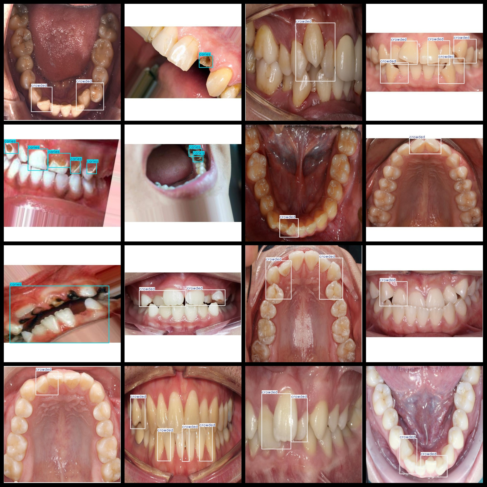

# [Object Detection] Teeth Health Detection Dataset 4700 images YOLO+VOC format

[Object Detection] Teeth Health Detection Dataset: 4700 Images in YOLO+VOC format

The dataset is organized in the following formats: VOC and YOLO.

The package includes 3 folders, each containing images, xml, and txt files.

In the JPEGImages folder, there are a total of 4700 JPG images.

In the Annotations folder, there are a total of 4700 xml files.

In the labels folder, there are a total of 4700 txt files.

There are a total of 3 label categories: ["calculus", "caries", "crowded"].

The label names correspond to the Chinese translations: ["Dental Calculus", "Decayed Tooth", "Crowded"].

The number of boxes (note that the order of categories in the Yolo format does not match this, but is based on the classes.txt in the labels folder):

- "calculus" has 1567 boxes
- "caries" has 3206 boxes
- "crowded" has 6002 boxes

Total box count: 10775

The image resolution is clear (pixels).

The images have been enhanced.

The shape of the labels is rectangular boxes for target detection recognition.

Important Notes: No specific statements are provided at this time.

Special Disclaimer: This dataset does not guarantee the accuracy or reasonableness of the trained models or weight files. The dataset only provides accurate and reasonable annotations.
## Images

---

Here is a pay link on Stripe (https://buy.stripe.com/3cs8yP7sY87d0vu9AB). Please contact me lonlonago@foxmail.com after funding $89, and I will send you a complete data files, thank you!

